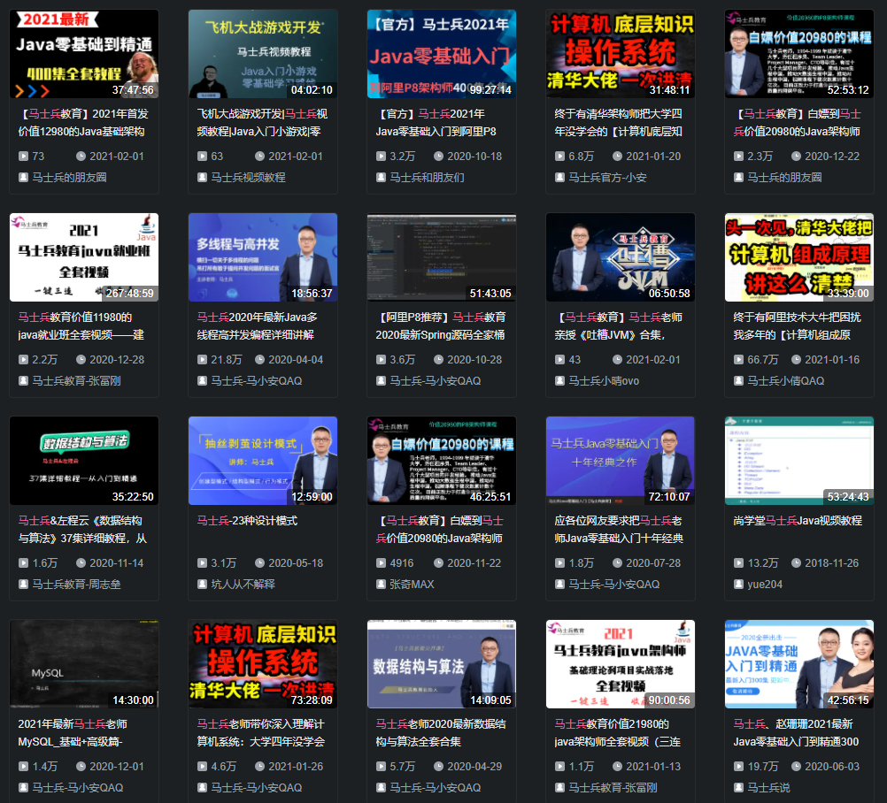
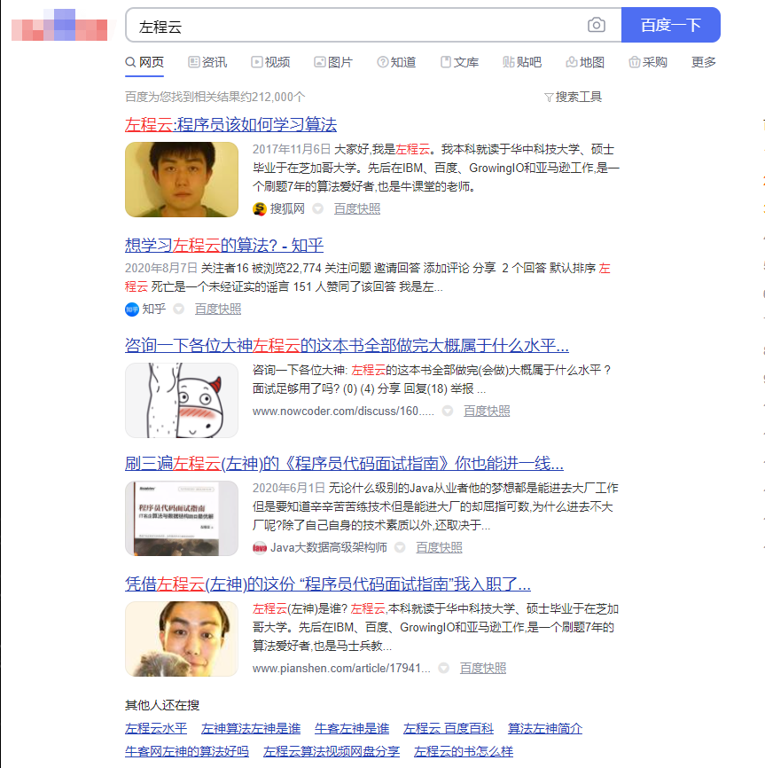
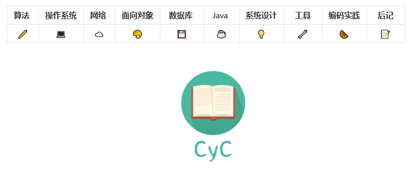
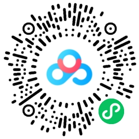

<!-- TOC -->

- [1. 摘要](#1-%E6%91%98%E8%A6%81)
- [2. 个人情况概述](#2-%E4%B8%AA%E4%BA%BA%E6%83%85%E5%86%B5%E6%A6%82%E8%BF%B0)
    - [2.1. 个人能力对标](#21-%E4%B8%AA%E4%BA%BA%E8%83%BD%E5%8A%9B%E5%AF%B9%E6%A0%87)
    - [2.2. 个人求职方向](#22-%E4%B8%AA%E4%BA%BA%E6%B1%82%E8%81%8C%E6%96%B9%E5%90%91)
    - [2.3. 投递&Offer情况](#23-%E6%8A%95%E9%80%92offer%E6%83%85%E5%86%B5)
- [3. 秋招流程](#3-%E7%A7%8B%E6%8B%9B%E6%B5%81%E7%A8%8B)
- [4. 准备阶段：学什么、怎么学？](#4-%E5%87%86%E5%A4%87%E9%98%B6%E6%AE%B5%E5%AD%A6%E4%BB%80%E4%B9%88%E6%80%8E%E4%B9%88%E5%AD%A6)
    - [4.1. 语言相关](#41-%E8%AF%AD%E8%A8%80%E7%9B%B8%E5%85%B3)
    - [4.2. CS基础](#42-cs%E5%9F%BA%E7%A1%80)
    - [4.3. CS进阶](#43-cs%E8%BF%9B%E9%98%B6)
    - [4.4. 大厂必备：手撕代码](#44-%E5%A4%A7%E5%8E%82%E5%BF%85%E5%A4%87%E6%89%8B%E6%92%95%E4%BB%A3%E7%A0%81)
    - [4.5. 加分项：准备一个项目](#45-%E5%8A%A0%E5%88%86%E9%A1%B9%E5%87%86%E5%A4%87%E4%B8%80%E4%B8%AA%E9%A1%B9%E7%9B%AE)
- [5. 面试相关](#5-%E9%9D%A2%E8%AF%95%E7%9B%B8%E5%85%B3)
- [6. 面试简录（俗称《面经》）](#6-%E9%9D%A2%E8%AF%95%E7%AE%80%E5%BD%95%E4%BF%97%E7%A7%B0%E9%9D%A2%E7%BB%8F)
- [7. Q&A、Tips](#7-qatips)
    - [7.1. 关于“海投”](#71-%E5%85%B3%E4%BA%8E%E6%B5%B7%E6%8A%95)
    - [7.2. 什么语言好？](#72-%E4%BB%80%E4%B9%88%E8%AF%AD%E8%A8%80%E5%A5%BD)
    - [7.3. 读资料 or 自己整理？](#73-%E8%AF%BB%E8%B5%84%E6%96%99-or-%E8%87%AA%E5%B7%B1%E6%95%B4%E7%90%86)
    - [7.4. 有哪些友好的资料源、工具？](#74-%E6%9C%89%E5%93%AA%E4%BA%9B%E5%8F%8B%E5%A5%BD%E7%9A%84%E8%B5%84%E6%96%99%E6%BA%90%E5%B7%A5%E5%85%B7)
    - [7.5. 推荐学习？](#75-%E6%8E%A8%E8%8D%90%E5%AD%A6%E4%B9%A0)
    - [7.6. 天时地利人和，还要看“运气”。](#76-%E5%A4%A9%E6%97%B6%E5%9C%B0%E5%88%A9%E4%BA%BA%E5%92%8C%E8%BF%98%E8%A6%81%E7%9C%8B%E8%BF%90%E6%B0%94)
- [8. 附录：](#8-%E9%99%84%E5%BD%95)
    - [8.1. 文件夹【资料集】说明](#81-%E6%96%87%E4%BB%B6%E5%A4%B9%E8%B5%84%E6%96%99%E9%9B%86%E8%AF%B4%E6%98%8E)
    - [8.2. 其他学习资源](#82-%E5%85%B6%E4%BB%96%E5%AD%A6%E4%B9%A0%E8%B5%84%E6%BA%90)
        - [8.2.1. 侯捷老师C++系列课程](#821-%E4%BE%AF%E6%8D%B7%E8%80%81%E5%B8%88c%E7%B3%BB%E5%88%97%E8%AF%BE%E7%A8%8B)
        - [8.2.2. 算法：左程云《算法初级》《算法进阶》](#822-%E7%AE%97%E6%B3%95%E5%B7%A6%E7%A8%8B%E4%BA%91%E7%AE%97%E6%B3%95%E5%88%9D%E7%BA%A7%E7%AE%97%E6%B3%95%E8%BF%9B%E9%98%B6)
        - [8.2.3. 算法：直通BAT算法精讲](#823-%E7%AE%97%E6%B3%95%E7%9B%B4%E9%80%9Abat%E7%AE%97%E6%B3%95%E7%B2%BE%E8%AE%B2)
        - [8.2.4. 算法：高频题目精讲](#824-%E7%AE%97%E6%B3%95%E9%AB%98%E9%A2%91%E9%A2%98%E7%9B%AE%E7%B2%BE%E8%AE%B2)
        - [8.2.5. Github阅读材料](#825-github%E9%98%85%E8%AF%BB%E6%9D%90%E6%96%99)
            - [8.2.5.1. labuladong的算法小抄](#8251-labuladong%E7%9A%84%E7%AE%97%E6%B3%95%E5%B0%8F%E6%8A%84)
            - [8.2.5.2. 众筹CS-Note（120k Star）](#8252-%E4%BC%97%E7%AD%B9cs-note120k-star)
        - [8.2.6. 牛客网项目（初级、中级、高级）](#826-%E7%89%9B%E5%AE%A2%E7%BD%91%E9%A1%B9%E7%9B%AE%E5%88%9D%E7%BA%A7%E4%B8%AD%E7%BA%A7%E9%AB%98%E7%BA%A7)

<!-- /TOC -->

# 1. 摘要

签约之后，陆陆续续有几位师弟师妹询问我找工作的事情。关于如何准备、如何面试、面试内容、怎么刷题、怎么做简历等等。在实验室2018级硕士中，我手上的offer只能算中等，个人能力也很有限。所以对于师弟师妹的请教，感动之余多有惶恐。一直想小结一下今年我个人的校招情况，这次正好借这个机会把想到的梳理后呈现给大家。这篇文章不会很长，偏口语化（尽量不啰嗦），可快速阅读，只要其中一两句对你有帮助，就算发挥它的价值了。

鉴于目标读者大都为没参加过实习以及招聘的同学，我会大致介绍秋招的流程、如何准备复习、什么是以及如何面试、什么是以及如何刷题等问题。此外，本文简要记录了个人面试的情况，附件中包含秋招流程中所有自己作||帮别人做的笔试、面试coding题。大家可以看一看，直观感受一下笔试和面试分别的coding难度。

在动笔前收集了师弟师妹们关于秋招的一些迷思，部分问题会融合在正文部分讲，部分作为Q&A放在文章末尾。仁者见仁智者见智，我会尽量客观的写，但是我的客观脱离不了主观限制，还是会存在偏差，大家务必选择性吸收。

# 2. 个人情况概述

## 2.1. 个人能力对标

**首先简述我的情况，目的是方便比对，大概清楚自身的长处与短板、所处的阶段**。

我本科瓜大软工，硕士瓜大计算机，本硕成绩中上游，竞赛平平无奇，无甚奖项，这些看简历就能知道。以百分制衡量自己的水平：

能力 | 分数 | 描述
---|----|---
工程编码能力 | 60 | 堪堪及格。具体表现为，未独立开发过完整应用系统，只独立开过课程设计（简单BS系统），不了解各类开发框架
算法编码能力 | 75 | 中等水平。表现为LeetCode Easy基本会做，Median会做十之六七，Hard会做十之一二
基础知识 | 35（复习前） | 大二大三学的专业课，没经考研，忘得一干二净，只知道大体的学科框架
基础知识 | 75（复习后） | 压过及格线，知识体系有明显短板，未复习数据库，粗略复习（仅仅读过一两个简单的知识点梳理pdf）操作系统、计算机网络；未学习各类框架，未深入分布式、云计算等知识，仅限于知道，问第一个问题可能答得上来，第二第三问必露拙的水平；无实习经历
思维能力 | 80 | 良。解释为：构建自己有限知识之间相互联系的能力，面试过程中诱导面试点走向、言语不给自己挖坑的自觉性
面试表达 | 90 | 优。长江说得好，要自信。如果没有自信的本钱，就盲目自信一点，面试官面前不畏缩。表现为，在面试过程中形成一套自己的话术，知道的哪些可以说，可以说的怎么个顺序、方法说。准备要充分
面试状态 | 85 | 单纯说状态，不解释。

<!-- - 工程编码能力60分，堪堪及格。具体表现为，未独立开发过完整应用系统，只独立开过课程设计（简单BS系统），不了解各类开发框架；
- 算法编码能力75分，中等水平。表现为LeetCode Easy基本会做，Median会做十之六七，Hard会做十之一二；
- 复习前基础知识40分，不及格。大二大三学的专业课，没经考研，忘得一干二净，只知道大体的学科框架；复习后基础知识75分，压过及格线，知识体系有明显短板，未复习数据库，粗略复习（仅仅读过一两个简单的知识点梳理pdf）操作系统、计算机网络；未学习各类框架，未深入分布式、云计算等知识，仅限于知道，问第一个问题可能答得上来，第二第三问必露拙的水平；无实习经历。
- 思维能力80分，良。解释为：构建自己有限知识之间相互联系的能力，面试过程中诱导面试点走向、言语不给自己挖坑的自觉性；
- 面试表达90分，优。长江说得好，要自信。如果没有自信的本钱，就盲目自信一点，面试官面前不畏缩。表现为，在面试过程中形成一套自己的话术，知道的哪些可以说，可以说的怎么个顺序、方法说。准备要充分；
- 面试状态85分，优。单纯说状态，不解释。 -->

前三点和后三点互为补充。一力破十会，在实力足够强的前提下，不用什么面试技巧。后三点算作个人优势，实践后自觉容易进入面试状态，也能为我争取一部分面试过程中的主动权。**主动权很重要**。

## 2.2. 个人求职方向

**接着说说个人“求职知识栈”，目的是帮助大家明确哪些经验对你比较有用，哪些可做借鉴**。

要点 | 说明
------- | -------
主选语言 | **C++**、**C++**、**C++**
面试职位 | 后端开发工程师（主要）
核心课程 | 操作系统、计算机网络、数据结构、算法、面向对象、数据库
面试核心、高频考察点 | **C++2.0特性**（包罗万象）、STL设计与优化、操作系统组成、系统调用、语言底层、网络结构、协议相关与设计（TCP、UDP、HTTP，挥手握手、正常情况、**异常情况**）、Linux、**多线程与高并发**
面试代码考察点 | **按思想**：搜索、递归、规划；**按数据结构**：二叉树、数组和字符串、数据结构设计；**设计模式**：单例

    以上均按权重排序。

看得出来。以C++为主要语言的后台开发岗位，更关注**操作系统底层与网络**。高并发这类比较花里胡哨的问的少，但是也会有面试官问到如消息队列的中间件知识。只是要求不会那么高。

## 2.3. 投递&Offer情况

**最后说说投递和Offer情况**。求其上者得其中，求其中者得其下。水平不足，能力有限。想要更好Offer的从本文中能吸收的会很有限。但是另一方面，本文所提也是更好Offer的底线。

投递及offer情况如下：

1. **百度：搜索架构部门C++开发工程师，sp**
2. 腾讯：腾讯地图后台开发工程师，技术二面挂
3. 阿里：阿里云神龙团队开发（做板子的），主管面挂
4. 字节：基础架构部门，主管面挂
5. 京东：未过简历
6. **华为：投递算法创新Lab，实发SRE，15级**
7. **深信服：云计算与网络安全后台开发，大sp**
8. **招银网络科技：后台开发工程师，sp**
9. **ThoughtWorks：开发工程师，白菜**
10. **中信证券：人工智能与量化模型开发工程师，未知offer评级前拒**
11. **兴唐通讯（研究所、国企一体两面）：架构设计师，未知offer评级前拒**
12. shopee：未过简历
13. 虎牙直播：未过简历
14. 碧桂园：管培生，杳无音信

以上大概是整个秋招过程中投递的所有企业。我投的互联网公司很少，一方面是考虑到自己技术不过硬、水平不足，一方面是考虑到有些offer拿了也不会去。除了以上14家以外，应该还投了几家银行证券企业，投了与开发不相关的岗位，或没有笔试，或杳无音信，不一而足。抱着的心思就是面着玩玩，想见识见识他们都怎么招人的。

没有投递上研究所（等我去投人已经招完了）是一遗憾，也没投更多的国企，因为好些要考，我有比较懒。**如果大家想投递互联网之外的企业单位，需早做准备，查询时间节点、招聘渠道、单位用人倾向、技能需求、笔试/面试内容及特点**，等等。

以上所列，没过简历的原因有：

- 不招C++
- 后台开发招聘疲软（以jd为典型）

选择一门语言的作用，就在于此。没过的面试大都倒在了主管面，这个后面面经里说。

# 3. 秋招流程

这个貌似不那么重要，就大概说一下，因为有师弟问到了。

结合时间线简单说明吧：

1. 大约**2-3月份**开始刷题，唯独这一点需要时间积累，难迅速提高，越早越好；
2. 根据个人情况，**4-5月**开始复习操作系统、网络、数据库等学科基础知识，以及根据求职方向选择学习C++2.0、JVM、ML DL理论、中间件等知识；
3. **6-7月份，各厂提前批开始**。所谓提前批就是一轮招聘的批次，取了个名字而已，还有什么大牛批、巨牛批，一个意思。**互联网提前批很重要**，**互联网提前批很重要**，**互联网提前批很重要**，因为提前批就可以招人招到接近饱和。有明确就职意向的同学，提前关注想去的公司往年提前批时间。精心准备简历，**注意投递节点，注意投递节点，注意投递节点**！
4. **8-9月份，各厂正式批陆续开始**。正式批的意思就是，这一波没上车后面就没车了。当然，奔着补招和春招，不稳妥。

以上是我**个人的**时间安排，因为我比较懒，**没有准备开发项目**，基础知识大都是临时抱佛脚。大家根据自己的情况，规划好时间，**如果不想秋招时候如坐针毡，这个寒假最好大概拟个学习计划**。

另外，互联网公司、研究所、国企、选调生各成体系，按需了解，早做准备。

# 4. 准备阶段：学什么、怎么学？

## 4.1. 语言相关

不用C++的同志可以跳过这一部分。

首先，重中之重，C++2.0相关知识。由浅而深大致为：C++基础、C++2.0“新”特性、C++标准演变、STL设计、C++内存管理。后面几个都很重要。**必读书目**：《C++ Primer》，**推荐必修课程**：《侯捷老师C++系列课程全集》。

资料连接见附录。

## 4.2. CS基础

操作系统、计算机网络、数据库。这些我是对着**牛客网的C++面经手册**、师兄传下来并加以完善的《**面试题集锦**》复习的。

虽说上面这些**对C++开发岗位几乎完全够用**，如果有时间，还是推荐找本书来看。

## 4.3. CS进阶

这一块儿我没有系统学习，都是零碎的看过一些博客、B站视频。如：**马士兵**教育公开课-系统调用专题、**马士兵**教育公开课-TCPIP、**消息队列设计**、多线程与高并发，等等。

资源比较零散没往这里放，大家结合岗位需求和语言倾向，看看要学什么。**Bilibili永远滴神，你想要的全都有**。

此外，对于C++的同学，Linux、Nginx的学习也是必须的。比如学Nginx，它为啥好，好在哪，怎么实现的？要能说得出来。能学多细学多细，考察到什么程度由面试官决定。

## 4.4. 大厂必备：手撕代码

    “我们知道你们会刷题，你们也知到我知道你们会刷题。但是这个东西咱们还是会考察。你刷题了吗？刷了多少？”
    ————字节三面面试官，本场面试没做题

关于刷题的道理这位面试官说的很明白。题还是要做，毕竟相对于其他计算机基础，**最好补的就是做题了**。最近几年的趋势就是手撕代码。有让用纸和笔手写代码的、有让用计算机白板手写代码的、有面试现场让用电脑现场写代码的。方式多种多样，对你的唯一要求就是**基本功扎实**。对于大多数如你我一般的菜鸡，如果连这种花点时间下下功夫的事情都做不好，凭什么说你重视秋招？另外，刷题这件事，说白了就是熟练度。大多数的我们智商相当，他做出来你没做出来，只是因为他熟练。

总之，手撕代码作为笔试的大头、面试的重点难点必考点，不可怕也不简单，需悉心对待。

学习路线：

1. 刷一遍《剑指Offer》，**上手，找感觉**；
2. 学习左程云左神《算法初级班》，**熟悉、入门**；
3. 学习左程云左神《算法进阶班》，知识是水盆里的水，看你这块儿海绵能吸进去多少；
4. 学习左程云左神《直通BAT算法精讲》；
5. 学习左程云左神《算法高频题目精讲》；

注意：

- 所列课程大都是我压着学过的，未尽得其中奥妙，但质量过硬，推给大家；
- 《剑指》必须先刷，因为简单，当然，如果有刷LeetCode习惯或经历，可跳过这一步；
- 左神讲课深入浅出富有趣味，听过的自然懂，学久了乏而不累，小白大佬两相宜。课程2、3结对，4、5结对，学习顺序自定。《高频题》和《直通BAT》相对难度大，小白通过《初级班》打底子也是可以。大家**如果纯算法编码量在3000行以上，或熟悉各种算法思想、常用数据结构，可以考虑直接用《进阶版》打底子**。
- “学习”指的是，听课听懂，**同步coding，自己写2-3遍**，能独立写出来为止；
- 左神有书《**程序员代码面试指南**》，**面试算法唯一神书**。我没有pdf资源，大家可以去淘宝买。
- **还有最重要的一点，视频学习和刷LeetCode不冲突**。不过说来惭愧，我是学完视频（效率实在不行，懒），有了体系之后去刷的LeetCode，前后统共加起来，也不过做了300来道。

## 4.5. 加分项：准备一个项目

我们教研室大都没有实习经历，这点多少有些吃亏，但是不至于说找不到好工作。

奔着大厂去的，准备个项目吧。无论是java还是c++，所准备的项目大小不论，但需“五脏俱全”。C++这里推荐**小型高可用服务器**，设计高并发与多线程的理论依据与实现方式、网络编程，甚至协议定制等等。这些都是不断在大厂面试中被问到的内容。

资料集中有一个项目，但是是好久之前挡下来的。同学们如果有这个需要，可以自己去github上找适合的项目。

# 5. 面试相关

    “面试是面，不是点。”            ————东哥某基友

读者一定会有“背面经”的阶段。后天要面百度搜索架构的后台开发了，这几天盯着牛客搜的“百度 搜索架构 面经”不放，各种阅读、分析、记忆。

**面经仅可参考，不可迷信**。对应聘者而言，每个人的**简历都是不一样的**，面试思路、话术、思维敏捷性、聊天习惯均不同，性格不同，“实诚”程度也不同。对于面试官来说，面试习惯、性格不同，水平最低的对着面经提问，高点的抓住你的回答步步深入，再牛点给你设计场景问你很灵活的问题，关注你的思维能力。面试的轮次、面试官的level、面试的部门岗位都会致使面试发生变化。

然千变万变，不离其宗。吾道一以贯之————

**面试就是聊天，聊天嘛，知道我想知道的基础之上，开心就好啦。**

当我们讨论“聊天”的时候，我们在讨论什么？

为什么聊？聊什么？怎么聊？

当换位思考之后，站在面试官的角度，就不难揣测，技术面面试官想知道什么，主管面面试官想知道什么，HR想知道什么。

如果我是技术面面试官，我会想，我在面的人他报的哪个岗位？这个岗位上哪些知识技能比较重要？是操作系统底层、组成原理、网络通信，还是网络安全？我司的档次，给他出个什么level的手撕代码题才能显示出我对他的敬意？他的简历上写了个实习经历，他干了啥？解决了什么问题？怎么设计的方案？怎么做的调研？怎么实现的？核心技术是什么？遇到什么困难？怎么解决的？……

如果我是主管，我会寻思，这个人对我们部门了解多少？对我们部门的业务了解多少？这娃的学习能力怎么样？学习习惯如何？平时会不会主动读书、钻研技术？热爱加班吗？社交能力怎么样？团队合作能力怎么样，何以见得？**他是不是我部门需要的这种人**？

HR，了解我们的文化吗？他为什么要来面我们？他会不会留下来？这娃性格咋样？给他开多少钱合适？

说的挺玄乎（虚），是吧？最近实习陆续开始招聘了。不要怂就是干，面他个一两个，你就有体会了。**身处一个完完全全的买房市场，聪明的把自己推销给对方会帮助你更快更好的获得Offer。**

# 6. 面试简录（俗称《面经》）

第一，累了累了想偷懒；

第二，面经同质化太严重，参考性最差，写出来性价比也是最低。

结论：偷个懒吧，后面想写的时候再写。

# 7. Q&A、Tips

## 7.1. 关于“海投”

被问过很多次“师兄都投了哪些公司？”，不少同学是选择海投，我不喜欢。我没有明确的就职意向，因此私企、国企、外企各有包含，投递总数不多。如果唯一就职意向为“开发工程师”，简历可一式多投，海投起来也方便，如果就意向职位多元，建议精修简历，精准投放。

基于清晰地自我定位，一定的自信，如果在附以坚定地自信，可以非常精准的投递几家简历。（比如汪子龙学长）省时省力，不消多余功夫。

如果抱着“试试看”、“看运气”的心态，或者不够自信，或者不清楚自己的能力范围，可选择分梯度分领域投递。

总而言之，有目标更好，没目标盲目海投不智。

## 7.2. 什么语言好？

不同语言试用领域不同。如果想有更多选择，可java、go；想做底层、做网络，首选C++。算法岗，python也可。

看你对哪个熟练。复习难度如何？对语言有没有执念？等等。

## 7.3. 读资料 or 自己整理？

文件夹下存放面试之前整理的思维导图。别人的不如自己的，**复习前期**，看别人整理的思维导图可以更快的构建体系，**复习过程**多做笔记，好记性不如烂笔头，markdown、Mindmanager都是比较好的方式。自己的，当然是最好的。

## 7.4. 有哪些友好的资料源、工具？

- **Github永远的神**。左程云的算法笔记、labuladong的算法小抄、各路大神的复习资料、字节跳动的高频面试算法、各个大厂的面经，你想要的全都有。
- 善用牛客网。
- bilibili永远滴神。

第四节中有提到。

## 7.5. 推荐学习？

第四节有细致的陈述。附录中有资源链接。

## 7.6. 天时地利人和，还要看“运气”。

- 天时：2020年秋招遭遇疫情，一方面线下经济受挫、互联网欣欣向荣，带来了很多岗位机会；一方面遵循防疫要求线上面试居多，省了四处奔波的各种成本。那咱们教研室来说，五六月份才返校，也恰好提供了提前准备的可能。此，为天时。
- 地利：线上面试不容易紧张，对面试PTSD、轻中重度社恐的同学还是很友好的，无论是一对一还是一对多还是多对多的面试都比较容易集中精力，此为地利。
- 人和：论遇见一个“合得来”的面试官有多难。我运气不错，面试体验大都不错，也遇见过非常憧憬的面试官，即便最后没拿到offer。

所以你看，我说运气，真不是客套话。但是光今年疫情这个事，不好说好也不好说坏，从上述描述中貌似很美好，但是今年秋招面向两个年级、三个年级招聘的大有人在。加之国内外各类大佬深造改就业，卷的不是一般的厉害。大家去牛客上看看各种投票，今年头部几个公司的池子有多深。

所以，福兮祸兮。

再说面试官，面试是看点运气的。在面试之前大家一定要清楚，如果面试官只是想把你问倒，那可真是太简单了。随便丢几个工程实践中的问题没处理过你就凉了。但事实不是如此，通过面试了解你对所需技能的掌握程度，了解你的知识结构、学习习惯、工程思维、表达能力、性格其中的一点或几点，这是面试官的目的。**不管面试官自己清楚不清楚**，作为面试者都一定要清楚。日后大家在面试的过程中，一定会亲身体会到什么叫“面试官的水平”。运气好了，遇见个伯乐，循循善诱关注本质，会发现你这皮没上过路的千里马。运气不好了，被拉来面试的打工仔同志无脑丢给你几个问题做个笔录，或者碰上个就想让你造台火箭的，“啥这都不会？挂挂挂”你能有什么办法。所以大家要清楚：

最后想告诉大家，车到山前必有路，如果秋招到了十月还没拿（等）到offer，不要着急。主动联系HR，关注相关信息，在不饱和准备的情况下，你也能获得理想的Offer。

祝大家秋招顺利，旗开得胜！

# 8. 附录：

## 8.1. 文件夹【资料集】说明

包含代码、面经、思维导图、简历等。目录树如下：

    .
    ├── code
    │   ├── C++11特性
    │   │   ├── DesignModule
    │   │   ├── thread
    │   │   └── threadPoll
    │   ├── 开源项目【自学用】
    │   │   └── WebServer-master
    │   ├── 算法0：机试、面试真题-zd
    │   │   ├── 0506HUAWEI
    │   │   ├── 0520HUAWEI
    │   │   ├── 0520PDD
    │   │   ├── 0521NIUKE
    │   │   ├── 0617HUAWEI
    │   │   ├── 0620BIGUIYUAN
    │   │   ├── 0810HUAWEI
    │   │   ├── 0823TENCENT
    │   │   ├── 0824BAIDU
    │   │   ├── 0824ZHONGXING
    │   │   ├── 0825SHENXINFU
    │   │   ├── 0826HUAWEI
    │   │   ├── 0827ALI
    │   │   ├── 0827BAIDU
    │   │   ├── 0827JD
    │   │   ├── 0829
    │   │   ├── 0831ZXZQ
    │   │   ├── 0901TENCENT
    │   │   ├── 0902SHOPEE
    │   │   ├── 0903BAIDU
    │   │   ├── 0903TENCENT
    │   │   ├── 0906HUAWEI
    │   │   ├── 0910SHENXINFU
    │   │   ├── 0913HUAWEI
    │   │   ├── 0913SHENXINFU
    │   │   ├── 0915ZUIYOU
    │   │   ├── 0920BYTEDANCE
    │   │   └── 0921ZUIYOU
    │   ├── 算法1：《剑指Offer》《左程云算法精讲》
    │   ├── 算法2：LeetCode
    │   │   ├── bytedance
    │   │   ├── weekly-contest
    │   │   └── 笔记
    │   └── 算法3：labuladong算法小抄-FuckingAlgorithm
    ├── 复习资料、面经【阅读记忆】
    │   ├── C++-Lambda
    │   └── 牛客网资源
    │       ├── 左程云算法精讲题目代码
    │       ├── 数据库复习资料
    │       ├── 牛客网IT名企2016笔试真题+答案
    │       ├── 笔试册子
    │       └── 面经册子
    ├── 思维导图【按需梳理】
    ├── 材料评审【仅清单】
    └── 简历【可供参考】

## 8.2. 其他学习资源

### 《剑指Offer》 OJ

LeetCode：https://leetcode-cn.com/problemset/lcof/

牛客：https://www.nowcoder.com/ta/coding-interviews

### 8.2.1. 侯捷老师C++系列课程

以前B站有，写这篇的时候没查到，同学们也可自己找一找。

    链接：https://pan.baidu.com/s/10eNE_kuJdbdOMDF4uSGwXw 
    提取码：hcps 
    复制这段内容后打开百度网盘手机App，操作更方便哦

### 8.2.2. 算法：左程云《算法初级》《算法进阶》

    链接：https://pan.baidu.com/s/1s9KalDHreW2qqqC9HQh4lw 
    提取码：hcps 
    复制这段内容后打开百度网盘手机App，操作更方便哦

### 8.2.3. 算法：直通BAT算法精讲

    链接：https://pan.baidu.com/s/1swtTLHyGVt04qZx324HE7w 
    提取码：hcps 
    复制这段内容后打开百度网盘手机App，操作更方便哦

### 8.2.4. 算法：高频题目精讲

    链接：https://pan.baidu.com/s/18DXIDjaDVz4Z7dm-wPteDQ 
    提取码：hcps 
    复制这段内容后打开百度网盘手机App，操作更方便哦

### 8.2.5. Github阅读材料

#### 8.2.5.1. labuladong的算法小抄

源自Github：
        
    https://github.com/labuladong/fucking-algorithm

#### 8.2.5.2. 众筹CS-Note（120k Star）

    https://github.com/CyC2018/CS-Notes

### 8.2.6. 牛客网项目（初级、中级、高级）

    链接：https://pan.baidu.com/s/1dvHYecdAJnxlPLxyQJqaOw 
    提取码：hcps 
    复制这段内容后打开百度网盘手机App，操作更方便哦

